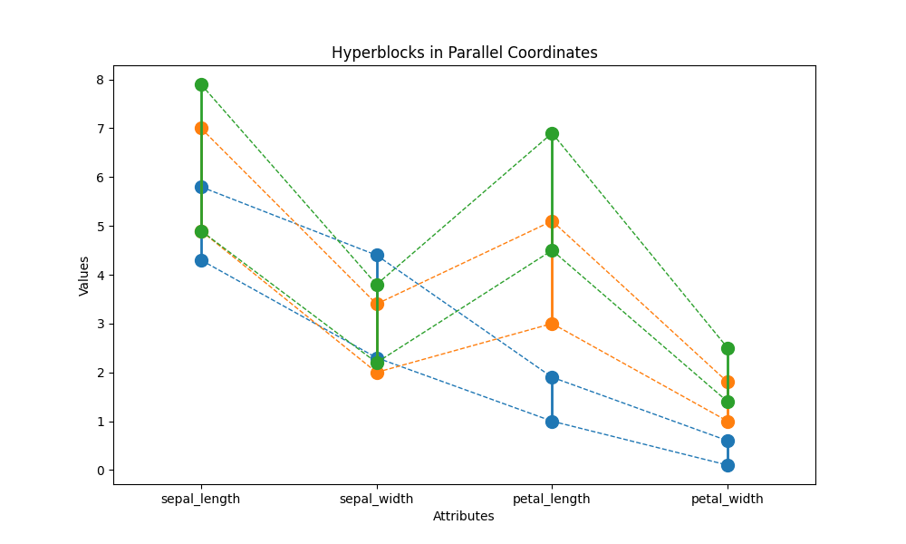
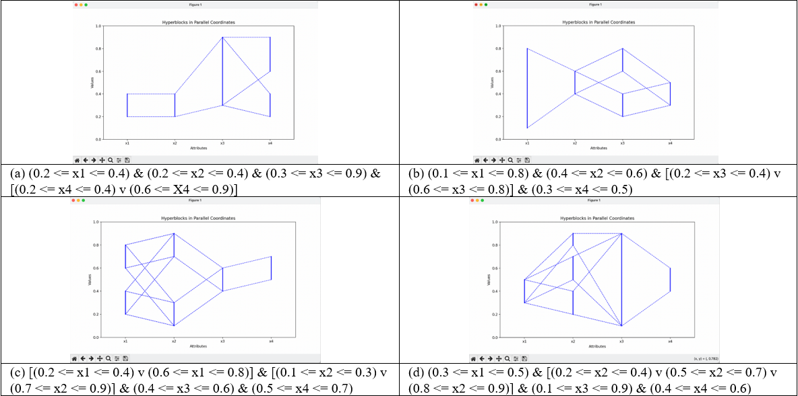

# HyperblockParser

A hyperblock (HB) is mathematically defined as a set of n-dimensional (n-D) points: $` \{ x = (x_1, x_2, \ldots, x_n) \} `$ with a center n-D point $` c = (c_1, c_2, \ldots, c_n) `$ and side lengths $` L = (L_1, L_2, \ldots, L_n) `$, such that $` \forall_i \| x_i - c_i \| \leq \frac{L_i}{2} `$.

We can write this as a conjunctive normal form (CNF) statement such as:

```txt
(0.2 < x1 <= 0.4) & (0.2 <= x2 <= 0.4) & [(0.2 <= x3 <= 0.4) v (0.6 <= x3 <= 0.8)]
```

This statement is parsed into a list of bounds for each attribute and visualized as a HB graph in PC where the graph is a upper and lower bound for each attribute and connected by polylines determined by the logical operators.



This project parses CNF HB notation to parallel coordinates (PC) visualizations using Python and Matplotlib. The program reads in CNF statements from a `statements.txt` file and visualizes them with Matplotlib as PC n-D graphs.



## Parsing

The parser supports HB statements in the following format:

### Basic Syntax

- Variables: Any alphanumeric variable name (case insensitive)
- Inequalities: `<` (strict) or `<=` (non-strict)
- Values: Decimal numbers between 0 and 1
- Logical operators:
  - `&` for AND
  - `v` for OR
  - `+` to combine multiple hyperblocks
- Parentheses: `()` to group expressions
- Brackets: `[]` to group disjunctions

### Statement Structure

1. Single bounds: `(0.2 <= temperature <= 0.4)`
2. Conjunctions: `(0.2 <= temp <= 0.4) & (0.3 <= pressure <= 0.5)`
3. Disjunctions: `[(0.2 <= humidity <= 0.4) v (0.6 <= humidity <= 0.8)]`
4. Combined hyperblocks: `<hyperblock1> + <hyperblock2>`

Please see the `statements.txt` file for more indepth examples.

## License

This project is licensed under the MIT License - see the [LICENSE](LICENSE) file for details.
